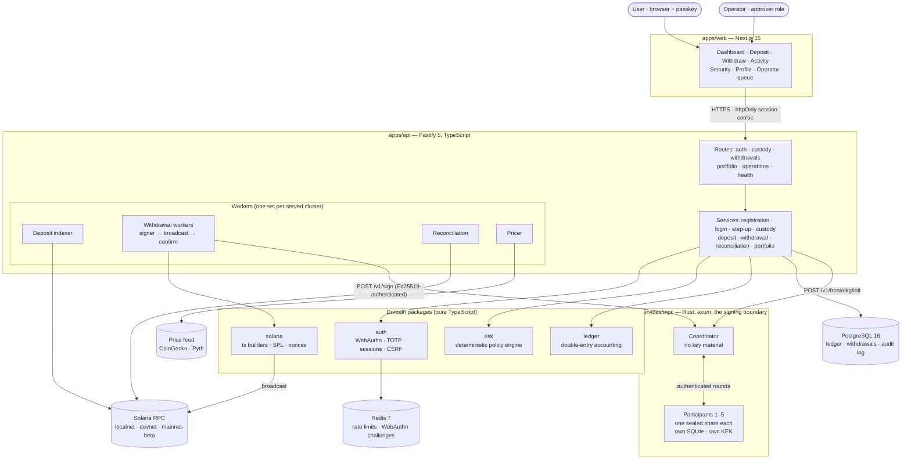
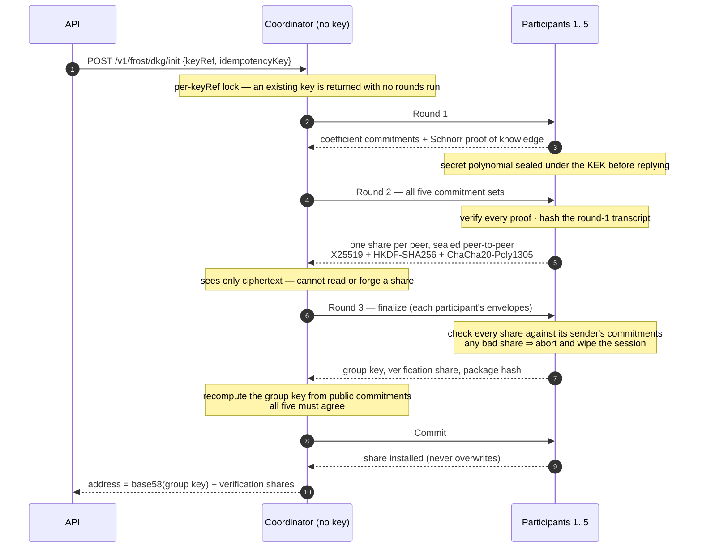
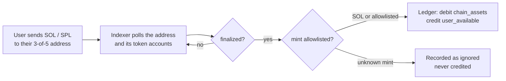
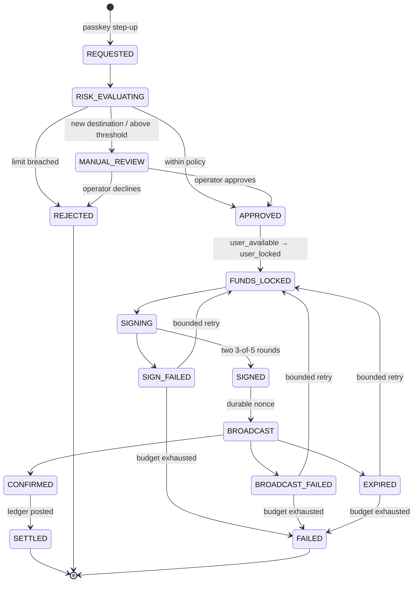
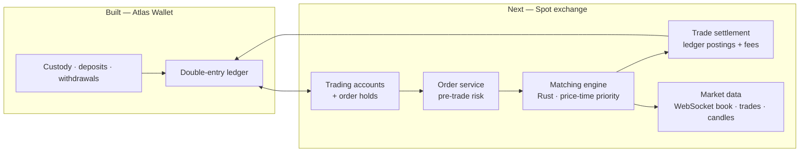

# CEX — a centralized crypto exchange, built custody-first

This repository is the foundation of a centralized crypto exchange. It is being
built in the order a real exchange has to be: **custody first**, because every
later product (spot trading, then derivatives) moves money that the custody
layer is responsible for.

The first product is complete and verified end to end on Solana devnet:

> **Atlas Wallet** — a custodial Solana wallet for SOL and allowlisted SPL
> tokens, in which every user's deposit address is **their own 3-of-5
> FROST-Ed25519 threshold key**, created by distributed key generation. No
> server, process or coordinator ever holds a private key.

> [!WARNING]
> Educational project. **Not audited. Not production custody. Never use it with
> real funds.**

| Product                          | Status                                           | Where                            |
| -------------------------------- | ------------------------------------------------ | -------------------------------- |
| Custodial wallet (Atlas Wallet)  | **Implemented** — localnet + devnet verified     | [`wallet/`](wallet)              |
| Spot exchange                    | **Next** — see [the roadmap](#roadmap-building-the-spot-exchange) | —                                |
| Derivatives (perps, futures, options) | Planned, after spot                          | —                                |

---

## Contents

1. [What works today](#what-works-today)
2. [System architecture](#system-architecture)
3. [Repository layout](#repository-layout)
4. [Custody: one threshold key per user](#custody-one-threshold-key-per-user)
5. [Money in: deposits](#money-in-deposits)
6. [Money out: the withdrawal state machine](#money-out-the-withdrawal-state-machine)
7. [The ledger](#the-ledger)
8. [Security model](#security-model)
9. [Local setup](#local-setup)
10. [Manual test on Solana devnet](#manual-test-on-solana-devnet)
11. [Testing and CI](#testing-and-ci)
12. [Documentation index](#documentation-index)
13. [Roadmap: building the spot exchange](#roadmap-building-the-spot-exchange)

---

## What works today

A user can:

- **Sign up and sign in with a passkey** (WebAuthn): no password, no seed
  phrase. TOTP is available as a second factor, with recovery codes. Sessions
  are opaque, server-side and revocable.
- **Get a deposit address** that is the public key of their own 3-of-5 threshold
  group, generated on first request by a DKG ceremony across five signing
  participants.
- **Deposit SOL or an allowlisted SPL token** (e.g. devnet USDC). It is credited
  once, and only after the transaction is `finalized`. Tokens from mints that
  are not allowlisted are recorded and never credited.
- **Withdraw**. The request is confirmed with a passkey step-up and passes the
  risk engine. If needed, an operator reviews it. Funds are locked in the
  ledger, the transaction is signed by two 3-of-5 threshold rounds (the house
  pays the fee, the user's key authorises the transfer), broadcast with a
  durable nonce, confirmed and settled.
- **See a portfolio** valued from a price feed (CoinGecko or Pyth), scoped per
  cluster so devnet balances never mix with mainnet ones.

Operators get a review queue with required decision notes, and role-based access
(`viewer` ⊂ `approver` ⊂ `custodian`). They also get dead-letter retry, metrics
and scheduled reconciliation of the ledger against the chain.

---

## System architecture



**The boundary that matters.** The TypeScript API can *ask* for a signature but
cannot produce one. Every request to the signing service is signed by the
caller. Each participant independently checks a **payload-bound approval proof**
and the **custody-tier policy** before contributing a signature share, so a
compromised coordinator can refuse to sign but cannot forge a signature. See
[ADR-0013](wallet/docs/adr/0013-mpc-trust-boundary.md) and
[ADR-0015](wallet/docs/adr/0015-threshold-parameters.md).

---

## Repository layout

```
CEX/
├── README.md                  ← you are here
└── wallet/                    pnpm + Turborepo monorepo
    ├── apps/
    │   ├── api/               Fastify — routes → controllers → services → repositories,
    │   │                      plus workers (indexer, withdrawals, reconciliation, pricer)
    │   │                      and scripts (provision-nonces, reconcile, grant-role)
    │   └── web/               Next.js — pages, feature folders, one typed API client
    ├── packages/
    │   ├── types/             Zod schemas: the single source of truth for every contract
    │   ├── config/            the ONLY place process.env is read; refuses bad config at boot
    │   ├── logger/            structured JSON, correlation IDs, allowlist redaction
    │   ├── errors/            typed error hierarchy with stable client-facing codes
    │   ├── db/                Prisma schema, migrations, repositories, transaction helper
    │   ├── auth/              WebAuthn, sessions, TOTP, step-up, CSRF
    │   ├── ledger/            double-entry accounting — no chain, no database
    │   ├── risk/              withdrawal policy engine — pure, deterministic, replayable
    │   ├── portfolio/         valuation
    │   ├── blockchain/        chain-agnostic Signer / KeyProvisioner interfaces + MPC client
    │   └── solana/            the only package allowed to import a Solana SDK
    ├── services/
    │   └── mpc/               Rust signing service: single-key | participant | coordinator
    ├── infra/                 docker-compose: PostgreSQL + Redis
    ├── scripts/               mpc-cluster.sh (local 3-of-5), verify-boundaries.mjs
    └── docs/
        ├── adr/               23 architecture decision records
        ├── runbooks/          12 operational procedures
        └── security/          threat model, dependency exceptions
```

Architectural boundaries are **enforced, not remembered**. ESLint rules and
[`scripts/verify-boundaries.mjs`](wallet/scripts/verify-boundaries.mjs) check
that domain packages never import a chain SDK, a database or a framework. They
also prove the lint rules actually fail when broken.

---

## Custody: one threshold key per user

The wallet started as an omnibus custodian (one pooled hot wallet) and moved to
**segregated custody** ([ADR-0020](wallet/docs/adr/0020-segregated-custody.md)):

- **No commingling.** Each user's funds sit at their own on-chain address.
- **No shared blast radius.** Compromising the participants for one user
  yields that user's funds, not the platform's.
- **No master seed.** The address *is* the group's public key, so nothing
  exists that could derive every user's key.

### Key generation: distributed, no trusted dealer

Keys are generated by interactive **Pedersen DKG with Feldman verifiable secret
sharing** (`frost-core`'s reference implementation that goes with RFC 9591),
`t = 3`, `n = 5`. See [ADR-0023](wallet/docs/adr/0023-frost-dkg.md).



What makes it safe with a coordinator in the middle:

| Threat                                   | Defence                                                                                                                   |
| ---------------------------------------- | ------------------------------------------------------------------------------------------------------------------------- |
| Coordinator reads shares in transit      | Each share is sealed to its recipient's X25519 key. Peer keys are **pinned** in `MPC_DKG_PEERS`, never supplied by the coordinator |
| Coordinator injects a share              | The envelope key mixes in a static–static DH that only the two participants can compute                                     |
| Coordinator shows different commitments to different participants | Every envelope is AEAD-bound to a hash of its sender's full round-1 view; a mismatch cannot decrypt and the ceremony aborts |
| Malicious participant sends a bad share  | The share is checked against its sender's commitments; the recipient aborts before storing anything and logs the culprit    |
| Partial failure leaves a split key       | Two-phase finish: `finalize` stores the share as pending, `commit` installs it only after all five agree; a partial commit is resumed, not restarted |

### Signing

Every withdrawal needs two ordinary Ed25519 signatures, each produced by a
3-of-5 FROST round ([ADR-0015](wallet/docs/adr/0015-threshold-parameters.md)):

- **The house key** is the fee payer and the durable-nonce authority, so a
  user holding only tokens and no SOL can still withdraw.
- **The user's own key** is the source of the funds.

Participants keep a **nonce ledger**: reusing a FROST nonce would reveal the
participant's share. So a nonce is recorded before its commitment is published,
and consumed with a conditional update that cannot succeed twice.

---

## Money in: deposits



- **Credit only at `finalized`**, because anything earlier can be rolled back
  ([ADR-0006](wallet/docs/adr/0006-confirmation-policy.md)).
- **Idempotent** on `(chain, tx_signature, instruction_index)`, so a replayed
  page or a restart cannot credit twice.
- **Tokens are allowlisted by mint address**, never by symbol, because anyone
  can create a token named "USDC" ([ADR-0016](wallet/docs/adr/0016-token-allowlist.md)).
- **The cluster is part of the asset key** (`devnet:SOL` ≠ `mainnet-beta:SOL`),
  so test balances can never be added to real ones
  ([ADR-0021](wallet/docs/adr/0021-cluster-dimension.md)).

---

## Money out: the withdrawal state machine



- **Every failure is a state, not an exception.** The legal transitions are
  declared once in `packages/types`. The database constraint is *generated* from
  that same table, and every transition is written to an append-only history
  table.
- **A lock is a balanced ledger transfer**, posted in the same database
  transaction as the state change. It doubles as the sufficient-funds check: two
  concurrent withdrawals cannot both win.
- **Durable nonces, not recent blockhashes.** A blockhash expires in 60–90 s,
  and a withdrawal through review and threshold signing will not reliably
  finish in time. With a durable nonce, the nonce advancing exactly once proves
  the transaction landed exactly once, so re-broadcasting identical bytes is
  always safe ([ADR-0009](wallet/docs/adr/0009-durable-nonce-accounts.md)).
- **The risk engine is pure.** It has no clock, database or config read, so a
  stored decision can be replayed later and explains itself. It runs every rule
  on every request (account state, destination validity, per-transaction limit,
  rolling 24 h limit, velocity, new destination, review threshold) and tells the
  client only a generic reason, so the endpoint cannot be used to probe limits
  ([ADR-0010](wallet/docs/adr/0010-risk-policy-baseline.md)).

---

## The ledger

Balances are never stored: a balance is always a projection over
`ledger_entries`. PostgreSQL enforces balanced transactions with a deferred
constraint trigger at commit.

| Account          | Class     | Holds                                                |
| ---------------- | --------- | ---------------------------------------------------- |
| `user_available` | liability | what a user may spend                                |
| `user_locked`    | liability | reserved against a pending withdrawal                |
| `chain_assets`   | asset     | what the platform controls on-chain, per owner       |
| `house_rent`     | equity    | SOL immobilised in rent-exempt minimums              |
| `house_fees`     | equity    | network fees — a prepaid balance that may not go negative |
| `external`       | contra    | the world outside the system                         |

```
debit  → increases an asset,    decreases a liability
credit → increases a liability, decreases an asset
```

`audit_log`, `ledger_entries`, `ledger_transactions`, `withdrawal_transitions`
and `risk_decisions` are **append-only**. The application's database role has
no `UPDATE` or `DELETE` on them, and a trigger stops even the schema owner
([ADR-0003](wallet/docs/adr/0003-database-roles.md)).

---

## Security model

**Defended** (details in the [threat model](wallet/docs/security/threat-model.md)):

- **Remote attackers:** passkeys bound to the origin, opaque revocable
  sessions, `Origin`-based CSRF checks, rate limits, and risk decisions the
  client never supplies.
- **Stolen sessions:** a fresh passkey step-up is required for withdrawals and
  credential changes ([ADR-0011](wallet/docs/adr/0011-step-up-tiering.md)).
- **Compromised API host:** it cannot sign, cannot reuse an approval on a
  different transaction, cannot escalate a custody tier, and cannot rewrite
  history.
- **Compromised coordinator:** it never holds a key, cannot read or inject DKG
  shares, and cannot get a key recorded that the participants did not derive.
- **Key material at rest:** shares, nonces and DKG state are AES-256-GCM
  ciphertext under a per-host KEK
  ([ADR-0014](wallet/docs/adr/0014-key-material-at-rest.md)).
- **Logs:** an allowlist logger drops any field it does not recognise, and a
  test throws every secret the system holds at it.

**Not defended**, stated plainly:

- **No independent audit.**
- **One machine.** The local 3-of-5 cluster is five processes on one host, so
  the threshold is only as strong as that host.
- **The approval key lives in the API process.**
- **No managed secret store**, and most secrets cannot be rotated.
- **No separation of duties.** One approver can approve alone, including their
  own withdrawal.
- **No DDoS protection.**
- **Sweeping is not wired up.**
- **The web withdraw form only sends SOL.** Token withdrawals are supported by
  the backend but not exposed in the UI.

---

## Local setup

### Prerequisites

| Tool                  | Version                              |
| --------------------- | ------------------------------------ |
| Node.js               | ≥ 22 (`wallet/.nvmrc`)               |
| pnpm                  | ≥ 10                                 |
| Docker                | for PostgreSQL 16 and Redis 7        |
| Rust                  | ≥ 1.80 (for `services/mpc`)          |
| Solana CLI            | Agave 3.x (`solana-test-validator`)  |
| OpenSSL               | for generating secrets               |

### 1. Install, configure, migrate

```bash
cd wallet
cp .env.example .env

# Fill these in .env:
openssl rand -base64 48   # -> SESSION_SECRET
openssl rand -base64 32   # -> TOTP_ENCRYPTION_KEY
openssl rand -base64 64   # -> DEPOSIT_SEED

pnpm install
pnpm infra:up                               # PostgreSQL :5433, Redis :6380
pnpm --filter @wallet/db generate
pnpm --filter @wallet/db migrate:deploy
```

Ports 5433 and 6380 are used instead of the defaults, so a Postgres or Redis
already on your machine is left alone.

### 2. Quickest start — mock signer, local chain

```bash
solana-test-validator --reset               # in its own terminal
set -a; source .env; set +a
pnpm dev
```

- Web: http://localhost:3000. Use `localhost`, not `127.0.0.1`: passkeys need
  a secure context.
- API: http://localhost:4000 · readiness: http://localhost:4000/health/ready

`SIGNER_KIND` defaults to `mock`, which produces signatures that verify against
nothing. That's fine for exploring the UI; production refuses to start with it.

### 3. Real 3-of-5 threshold signing

```bash
cargo build --release --manifest-path services/mpc/Cargo.toml
./scripts/mpc-cluster.sh start              # 5 participants :7071-7075, coordinator :7070
```

The script:

1. Generates a KEK per participant and the caller keys.
2. Runs `wallet-mpc dkg-identity` against each participant's store to create
   its DKG transport key, and pins all five public keys in every participant's
   `MPC_DKG_PEERS`.
3. Starts the coordinator, which generates the **house key by DKG**.
4. Writes `scripts/.mpc-cluster.env` (gitignored) with `SIGNER_KIND=real`,
   `SEGREGATED_CUSTODY=true`, the client keys and `TREASURY_ADDRESS`.

Then fund the treasury and create its durable nonce pool:

```bash
set -a; source .env; source scripts/.mpc-cluster.env; set +a
solana airdrop 100 "$TREASURY_ADDRESS" --url http://127.0.0.1:8899
pnpm --filter @wallet/api provision-nonces -- --cluster=localnet
pnpm dev
```

`GET /capabilities` should now report `"signing": {"mode": "threshold-mpc"}`.

> [!CAUTION]
> `mpc-cluster.sh start` **discards every key** from the previous run. Anything
> funded to the old treasury or to users' old addresses becomes unspendable.
> Restarting the API or web app is safe; restarting the cluster is not.

Stop everything:

```bash
pkill -f "filter @wallet/api dev"; pkill -f "filter @wallet/web dev"
./scripts/mpc-cluster.sh stop
pnpm infra:down
```

More detail: [local development](wallet/docs/runbooks/local-development.md) ·
[threshold deployment](wallet/docs/runbooks/threshold-deployment.md).

---

## Manual test on Solana devnet

This path was tested end to end: a DKG-generated address, a deposit, an
operator-approved withdrawal signed by 3-of-5 rounds, and on-chain settlement.

**1. Create a devnet overlay**, `wallet/.env.devnet` (gitignored by `.env.*`):

```bash
SOLANA_NETWORK=devnet
SOLANA_CLUSTERS=devnet
SOLANA_RPC_URL=https://api.devnet.solana.com
# Circle's devnet USDC — the mint address is the identity, not the symbol
TOKEN_MINTS=USDC:4zMMC9srt5Ri5X14GAgXhaHii3GnPAEERYPJgZJDncDU:6
# base units: per-tx 100 USDC, daily 500, manual review above 50
RISK_ASSET_LIMITS=4zMMC9srt5Ri5X14GAgXhaHii3GnPAEERYPJgZJDncDU:100000000:500000000:50000000
```

**2. Start the API on devnet** (with the MPC cluster from step 3 above running):

```bash
set -a; source .env; source scripts/.mpc-cluster.env; source .env.devnet; set +a
pnpm dev
```

The boot log must contain `chain network verified … devnet`. The API compares
the RPC endpoint's genesis hash with the cluster it claims to be.

**3. Fund the treasury.** Send about 1 devnet SOL to `$TREASURY_ADDRESS` from
your own wallet or https://faucet.solana.com (the CLI airdrop is often
rate-limited). The treasury pays every fee and the nonce-account rent.

**4. Provision the devnet nonce pool:**

```bash
pnpm --filter @wallet/api provision-nonces -- --cluster=devnet
```

**5. Use the app** at http://localhost:3000:

| Step               | What to do                                                                                          | What you should see                                   |
| ------------------ | --------------------------------------------------------------------------------------------------- | ----------------------------------------------------- |
| Register           | Create an account with a passkey                                                                    | Dashboard, with the network shown as devnet           |
| Deposit SOL        | Open **Deposit**, then send devnet SOL from Phantom/Solflare (set to Devnet)                         | Balance credited after finalization (~30 s)           |
| Deposit USDC       | Get devnet USDC at https://faucet.circle.com and send it to the same address                        | A USDC balance appears                                |
| Become an approver | See the command below                                                                               | `granted approver to …`                               |
| Withdraw SOL       | **Withdraw**, enter the destination and amount, confirm with the passkey                            | *In review* (first withdrawal to a new address)       |
| Approve            | **/operator**, click **Confirm with passkey**, add a note, **Approve**                              | Approved → Signed → Sent → Settled                    |
| Verify on-chain    | Open the transaction on Solana Explorer (devnet)                                                    | Two signers: the house key and your key               |

```bash
# find your user id, then grant the role (note: no "--" before "grant")
docker exec -e PGPASSWORD=wallet_app wallet-postgres psql -h localhost -U wallet_app -d wallet -At \
  -c "select id from users order by created_at desc limit 1;"
pnpm --filter @wallet/api grant-role grant <user-id> approver "manual devnet test"
```

**Troubleshooting**

| Symptom                                  | Cause / fix                                                                                          |
| ---------------------------------------- | ---------------------------------------------------------------------------------------------------- |
| Withdrawal stuck, logs `nonce.pool_exhausted` | No devnet nonce accounts — run `provision-nonces -- --cluster=devnet`                          |
| Requests return 400 after switching network | The browser remembers the old cluster — reload, or `localStorage.removeItem('atlas.cluster')`  |
| Operator page asks for a passkey         | The queue needs a fresh step-up — click **Confirm with passkey**                                     |
| Deposit never appears                    | Wallet not on devnet, or the mint isn't allowlisted — see [missing deposit](wallet/docs/runbooks/missing-deposit.md) |
| Balances look off                        | `pnpm --filter @wallet/api reconcile -- --cluster=devnet` compares the ledger with the chain         |

---

## Testing and CI

Run from `wallet/`:

```bash
pnpm lint && pnpm typecheck
pnpm test                                   # unit — no infrastructure
set -a; source .env; set +a
pnpm test:integration                       # real PostgreSQL, never a mock
pnpm test:e2e                               # Playwright + virtual WebAuthn authenticator
cd services/mpc && cargo test               # Rust: unit + socket-level integration
node scripts/verify-boundaries.mjs
```

| Suite                        | Count | What it proves                                                                  |
| ---------------------------- | ----: | ------------------------------------------------------------------------------- |
| TypeScript unit              |   501 | ledger, risk engine, auth, config, Solana encoding, the MPC client contract     |
| Integration (PostgreSQL)     |   224 | role grants, append-only triggers, deferred balance checks, full withdrawal flows |
| End-to-end (Playwright)      |    35 | auth, deposit, withdraw, network switching, portfolio in a real browser         |
| Rust (`services/mpc`)        |   124 | DKG over real sockets, forged-share rejection, coordinator state holds no secret, threshold signing, nonce reuse refusal |

The integration tests use a real PostgreSQL because what they check (grants,
triggers, deferred constraints, rollback) are properties of Postgres itself.

**CI** ([`wallet/.github/workflows/ci.yml`](wallet/.github/workflows/ci.yml)) runs:

- **Static checks:** lint, typecheck, unit tests and formatting.
- **Dependency audit** for JavaScript and Rust.
- **Boundary checks** that the architectural lint rules really fail when broken.
- **Integration tests** against PostgreSQL, including a check that migrations
  match the schema.
- **Localnet tests** against a real Solana validator.
- **Rust tests** for the MPC service.
- **Real-signer run:** the Phase 3 suite against the real signing service,
  failing if it signed nothing.

---

## Documentation index

### Architecture decision records

| ADR | Decision |
| --- | -------- |
| [0001](wallet/docs/adr/0001-session-strategy.md) | Opaque server-side sessions, not JWTs |
| [0002](wallet/docs/adr/0002-authentication-model.md) | Passkey-first authentication, with TOTP as a second factor |
| [0003](wallet/docs/adr/0003-database-roles.md) | Two database roles, and append-only enforced by the database |
| [0004](wallet/docs/adr/0004-deposit-address-model.md) | One derived deposit address per user per asset |
| [0005](wallet/docs/adr/0005-deposit-key-custody-class.md) | Deposit keys as a lower-privilege key class *(superseded by 0020)* |
| [0006](wallet/docs/adr/0006-confirmation-policy.md) | Credit only at `finalized` |
| [0007](wallet/docs/adr/0007-indexer-transport.md) | RPC polling behind an interface |
| [0008](wallet/docs/adr/0008-asset-allowlist.md) | SOL only in Phase 2 |
| [0009](wallet/docs/adr/0009-durable-nonce-accounts.md) | Durable nonce accounts, not recent blockhashes |
| [0010](wallet/docs/adr/0010-risk-policy-baseline.md) | The initial risk policy |
| [0011](wallet/docs/adr/0011-step-up-tiering.md) | Step-up freshness by withdrawal value |
| [0012](wallet/docs/adr/0012-retry-and-expiry-budgets.md) | Retry and expiry budgets |
| [0013](wallet/docs/adr/0013-mpc-trust-boundary.md) | The MPC trust boundary |
| [0014](wallet/docs/adr/0014-key-material-at-rest.md) | Key material at rest |
| [0015](wallet/docs/adr/0015-threshold-parameters.md) | 3-of-5 FROST-Ed25519, across independent failure domains |
| [0016](wallet/docs/adr/0016-token-allowlist.md) | SPL tokens: a per-mint allowlist; unknown mints recorded, not discarded |
| [0017](wallet/docs/adr/0017-sweep-policy.md) | A sweep is a withdrawal; its destination lives in the signing boundary |
| [0018](wallet/docs/adr/0018-custody-tiers.md) | Custody tiers are defined by signing policy, not by label |
| [0019](wallet/docs/adr/0019-second-chain-seams.md) | What a second chain would touch — and why none is added |
| [0020](wallet/docs/adr/0020-segregated-custody.md) | Segregated custody — per-user addresses, per-user keys, no omnibus |
| [0021](wallet/docs/adr/0021-cluster-dimension.md) | The cluster belongs in the ledger asset key |
| [0022](wallet/docs/adr/0022-valuation-and-prices.md) | Portfolio valuation, and where a price comes from |
| [0023](wallet/docs/adr/0023-frost-dkg.md) | FROST-Ed25519 distributed key generation — no trusted dealer |

### Runbooks

| Runbook | When |
| ------- | ---- |
| [Local development](wallet/docs/runbooks/local-development.md) | Setting up and common local problems |
| [Running the 3-of-5 deployment](wallet/docs/runbooks/threshold-deployment.md) | Starting the MPC cluster, nonce pools after a ceremony |
| [Key ceremony](wallet/docs/runbooks/key-ceremony.md) | Generating keys, DKG setup and verification |
| [Serving another Solana cluster](wallet/docs/runbooks/adding-a-cluster.md) | Enabling devnet / mainnet-beta |
| [Losing an MPC participant](wallet/docs/runbooks/participant-loss.md) | A participant host is gone |
| [Signing outage](wallet/docs/runbooks/signing-outage.md) | Signatures are not being produced |
| [A withdrawal is stuck](wallet/docs/runbooks/stuck-withdrawal.md) | A withdrawal is not progressing |
| [The ambiguous broadcast](wallet/docs/runbooks/ambiguous-broadcast.md) | It's unknown whether a transaction landed |
| [A deposit is missing](wallet/docs/runbooks/missing-deposit.md) | A user reports a deposit that isn't credited |
| [Reconciliation drift](wallet/docs/runbooks/reconciliation-drift.md) | Ledger and chain disagree |
| [A stuck sweep](wallet/docs/runbooks/stuck-sweep.md) | A sweep is not progressing |
| [Rotating SESSION_SECRET](wallet/docs/runbooks/session-secret-rotation.md) | Revoking all sessions |

Also: the [threat model](wallet/docs/security/threat-model.md) and
[dependency exceptions](wallet/docs/security/dependency-exceptions.md).

---

## Roadmap: building the spot exchange

The wallet already supplies what a spot exchange depends on: authenticated
users, a double-entry ledger that refuses unbalanced writes, balances that can
be locked atomically, deposits and withdrawals, a risk engine, operator
tooling, and a cluster-aware asset model. The spot exchange is built **on top
of** that ledger. Trading must never become a second source of truth for
balances.



### Phase S1 — Ledger and account model for trading

- [ ] **Trading accounts in the existing ledger:** `user_trading_available`,
      `user_order_hold`, `house_trading_fees`. An order hold is a balanced
      transfer, the same pattern `user_locked` already uses for withdrawals.
- [ ] **Instant internal transfers** between the wallet and trading balances,
      one ledger transaction each, with no chain involved.
- [ ] **Market definitions:** base/quote asset keys (e.g. `devnet:SOL` /
      `devnet:USDC`), tick size, lot size, minimum notional, price bands, and
      trading status (pre-open, open, halted).
- [ ] **ADR** for fixed-point price and quantity representation. Integers in
      base units only, never floats, as the ledger already requires.

### Phase S2 — Order management and pre-trade risk

- [ ] **Order API:** place, cancel, cancel-all and amend (cancel/replace),
      with idempotency keys like withdrawals.
- [ ] **Order types:** limit, market, IOC, FOK, post-only. Then stop-loss,
      take-profit and OCO as a trigger layer outside the engine.
- [ ] **Pre-trade risk:** the balance hold is the funds check (atomic, as with
      withdrawal locks), plus price bands, maximum order size, per-user order
      rate limits and self-trade prevention.
- [ ] **Order state machine** declared once in `packages/types` and enforced by
      a generated database constraint, with an append-only transition history.

### Phase S3 — Matching engine

- [ ] **`services/matching`** in Rust: one single-threaded, deterministic
      engine per market with price-time priority.
- [ ] **Event-sourced:** every input is sequenced into a write-ahead journal
      before matching, so the book can be rebuilt by replaying from a snapshot,
      and an identical input stream always produces identical trades.
- [ ] **Order book** built on price levels with FIFO queues. O(1) cancel via an
      order-id index.
- [ ] **Property and replay tests:** no crossed book after matching, filled
      quantity conserved, no trade outside limit prices, deterministic replay.
- [ ] **Benchmarks** for per-order latency and throughput per market.

### Phase S4 — Settlement and fees

- [ ] **Trades settle into the ledger** as balanced multi-leg transactions:
      buyer and seller asset legs plus maker/taker fee legs, released from the
      order holds in the same database transaction.
- [ ] **Maker/taker fee schedule** with volume tiers.
- [ ] **Reconciliation:** the engine's open-order holds versus ledger
      `user_order_hold` balances, alerting on drift, like wallet reconciliation.

### Phase S5 — Market data and trading UI

- [ ] **WebSocket feeds:** level-2 order-book snapshots with sequenced deltas,
      a public trade tape, and private order/fill updates per user.
- [ ] **OHLCV candles and 24 h tickers** in a time-series store.
- [ ] **Trading screen** in `apps/web`: order book, depth chart, price chart,
      order entry, open orders, fills and history, in the Atlas design system.

### Phase S6 — Operations, surveillance and hardening

- [ ] **Controls:** circuit breakers and market halts, a kill switch per market
      and globally, and a cancel-on-disconnect option.
- [ ] **Surveillance:** wash trading, spoofing and layering detection;
      operator views over fills and orders.
- [ ] **Proof-of-reserves:** publish liabilities against the per-user on-chain
      balances that segregated custody already makes checkable.
- [ ] **Resilience:** engine failover from the journal, load tests, runbooks for
      a halted market, a replay mismatch and a settlement backlog.

### After spot

1. **Derivatives:** perpetuals with funding rates and a mark-price index,
   dated futures, a liquidation engine, then options with Greeks and portfolio
   margin.
2. **Institutional features:** FIX / REST trading APIs, sub-accounts and
   market-maker programmes.
3. **Before real funds:** close the wallet gaps listed in the
   [security model](#security-model), independent audits, and regulatory and
   compliance integration (KYC/AML).

---

<sub>Educational project — not audited, not for real funds.</sub>
