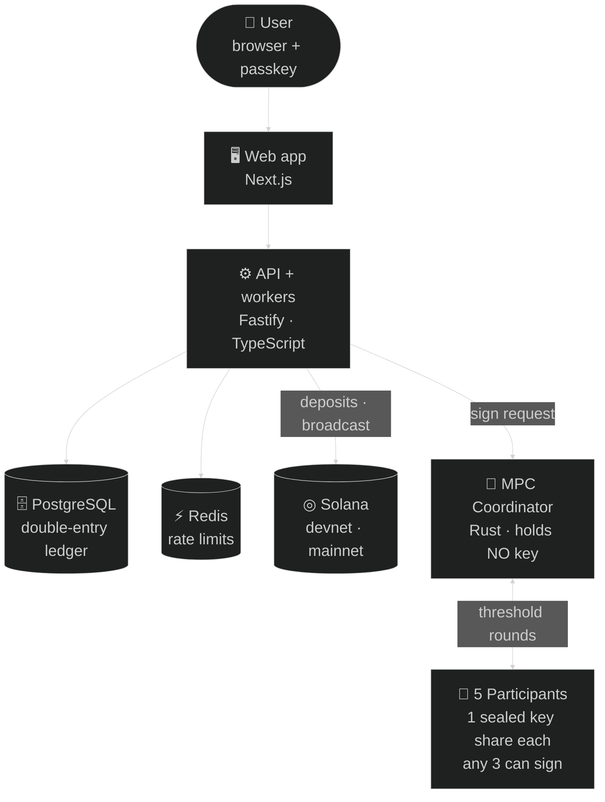
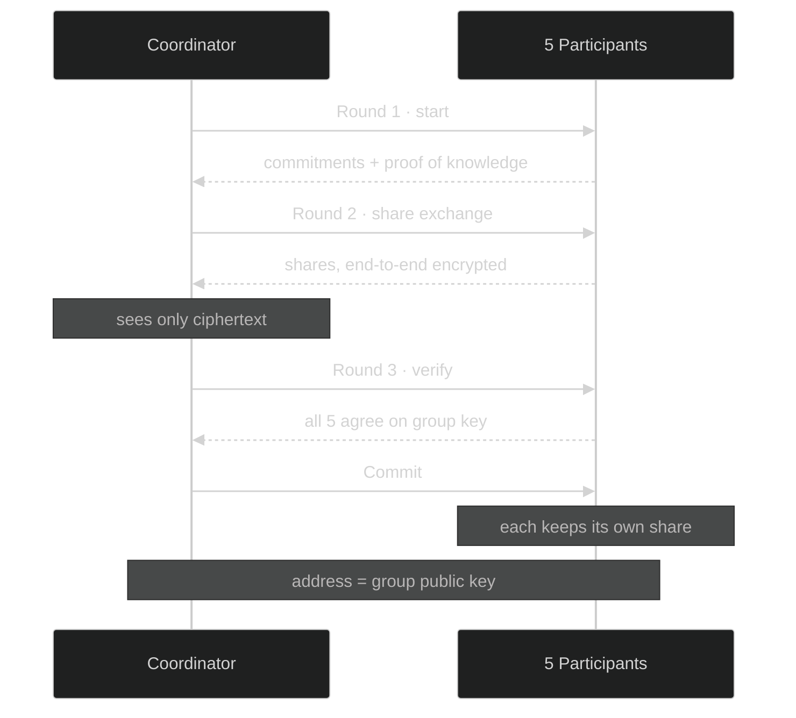
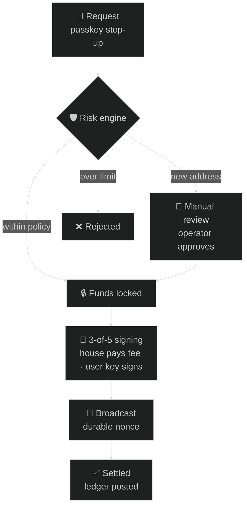
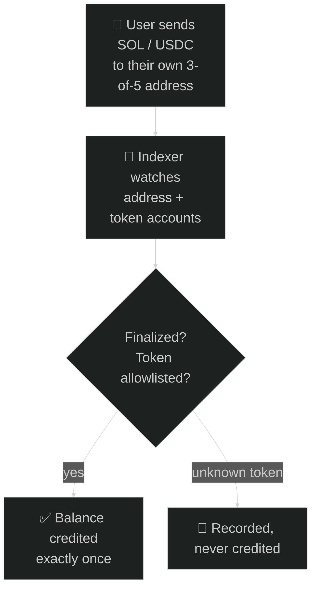

# Atlas Wallet — architecture

A custodial Solana wallet (SOL + SPL tokens) where every user's deposit address
is their **own 3-of-5 FROST-Ed25519 threshold key**, created by distributed key
generation. No server, process or coordinator ever holds a private key.

Rendered, high-resolution PNGs of each diagram are in `linkedin-diagrams/`.

---

## 1. System architecture

---

## 2. Key generation — no trusted dealer

---

## 3. Withdrawal lifecycle

---

## 4. Deposit flow

---

## Stack

| Layer    | Technology                                                            |
| -------- | --------------------------------------------------------------------- |
| Frontend | Next.js 15, React, WebAuthn passkeys                                  |
| API      | Fastify 5, TypeScript, Prisma 6, Zod                                  |
| Data     | PostgreSQL (append-only double-entry ledger), Redis                   |
| Signing  | Rust, axum, `frost-ed25519` 3-of-5, X25519 + ChaCha20-Poly1305        |
| Chain    | Solana — SOL + allowlisted SPL tokens, durable nonces                 |
| Tooling  | pnpm + Turborepo, Vitest, Playwright, Cargo                           |

Verified end to end on **Solana devnet**: DKG-generated user address, deposit,
operator-approved withdrawal signed by 3-of-5 threshold rounds, settled on-chain.

> Educational project — not audited, not for real funds.
