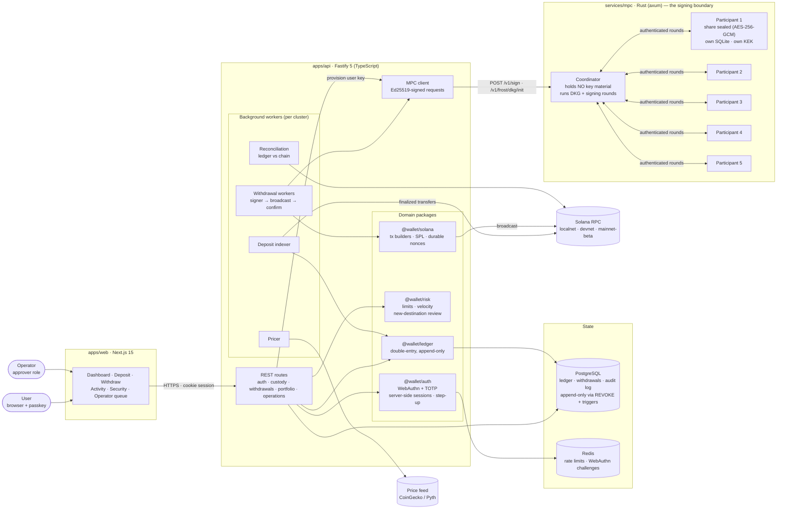
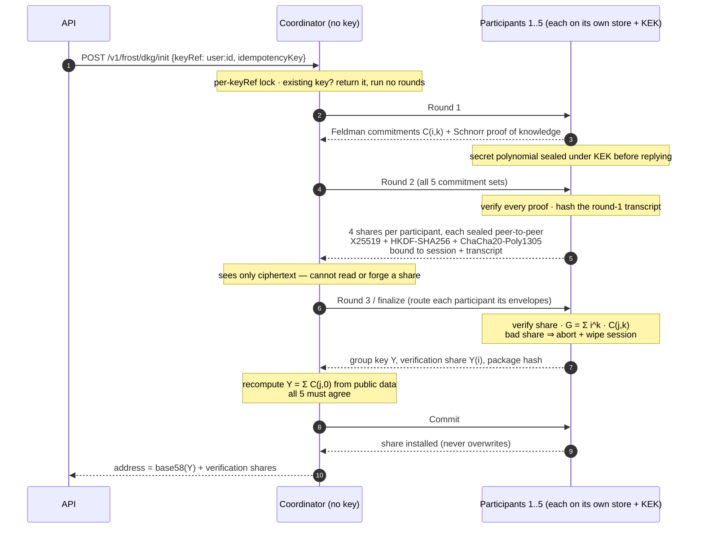

# Atlas Wallet — architecture

A custodial Solana wallet (SOL + allowlisted SPL tokens) where every user's
deposit address is their **own 3-of-5 FROST-Ed25519 threshold key**, generated
by distributed key generation. No server, process or coordinator ever holds a
private key.

---

## 1. System architecture

**Trust boundary:** the TypeScript API can *ask* for a signature but can never
produce one. Each participant independently verifies a payload-bound approval
proof and the custody-tier policy before contributing a signature share.

---

## 2. Key generation — distributed, no trusted dealer

---

## 3. Deposit and withdrawal lifecycle

```mermaid
flowchart TB
    subgraph deposit["Deposit"]
        d1["User sends SOL / SPL<br/>to their own 3-of-5 address"] --> d2["Indexer polls address<br/>+ token accounts"]
        d2 --> d3{"finalized?<br/>mint allowlisted?"}
        d3 -->|yes| d4["Ledger credit<br/>idempotent on tx + instruction"]
        d3 -->|unknown mint| d5["Recorded as ignored<br/>never credited"]
    end

    subgraph withdraw["Withdrawal state machine"]
        w1["REQUESTED<br/>passkey step-up"] --> w2["RISK_EVALUATING"]
        w2 -->|new destination / large| w3["MANUAL_REVIEW<br/>operator approves"]
        w2 -->|within policy| w4["APPROVED"]
        w3 --> w4
        w2 -->|limit breached| wr["REJECTED"]
        w4 --> w5["FUNDS_LOCKED<br/>user_available → user_locked"]
        w5 --> w6["SIGNING<br/>2 threshold rounds:<br/>house = fee payer + nonce authority<br/>user group = source"]
        w6 --> w7["SIGNED"] --> w8["BROADCAST<br/>durable nonce"] --> w9["CONFIRMED"] --> w10["SETTLED<br/>ledger posted"]
        w6 -.->|budget exhausted| wf["SIGN_FAILED / FAILED<br/>lock released"]
        w8 -.-> wx["BROADCAST_FAILED / EXPIRED"]
    end
```

---

## Stack

| Layer          | Technology                                                                 |
| -------------- | -------------------------------------------------------------------------- |
| Frontend       | Next.js 15, React, WebAuthn (`@simplewebauthn/browser`)                    |
| API            | Fastify 5, TypeScript, Zod-validated config, Prisma 6                      |
| Data           | PostgreSQL (double-entry ledger, append-only audit), Redis                 |
| Signing        | Rust, axum, `frost-ed25519` 3-of-5, `x25519-dalek`, ChaCha20-Poly1305      |
| Chain          | Solana — SOL + allowlisted SPL, durable nonces, per-cluster ledger keys    |
| Monorepo       | pnpm + Turborepo, Vitest, Playwright, Cargo                                |

Verified end to end on **Solana devnet**: DKG-generated per-user address,
deposit, operator-approved withdrawal signed by two 3-of-5 threshold rounds,
settled on-chain.

> Educational project — not audited, not for real funds.
