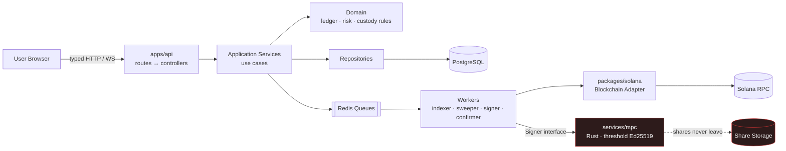
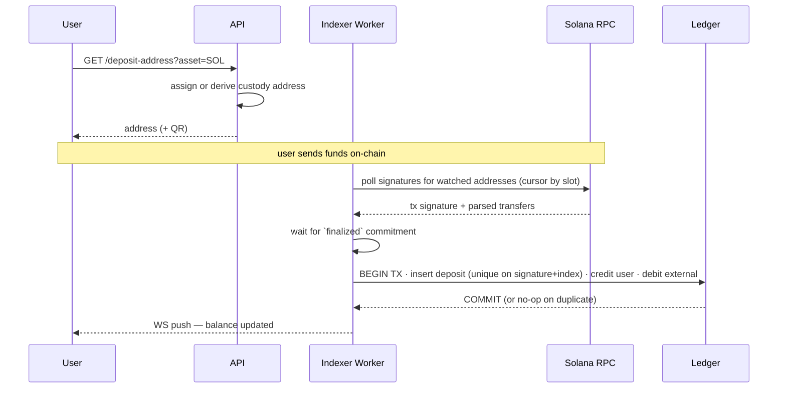
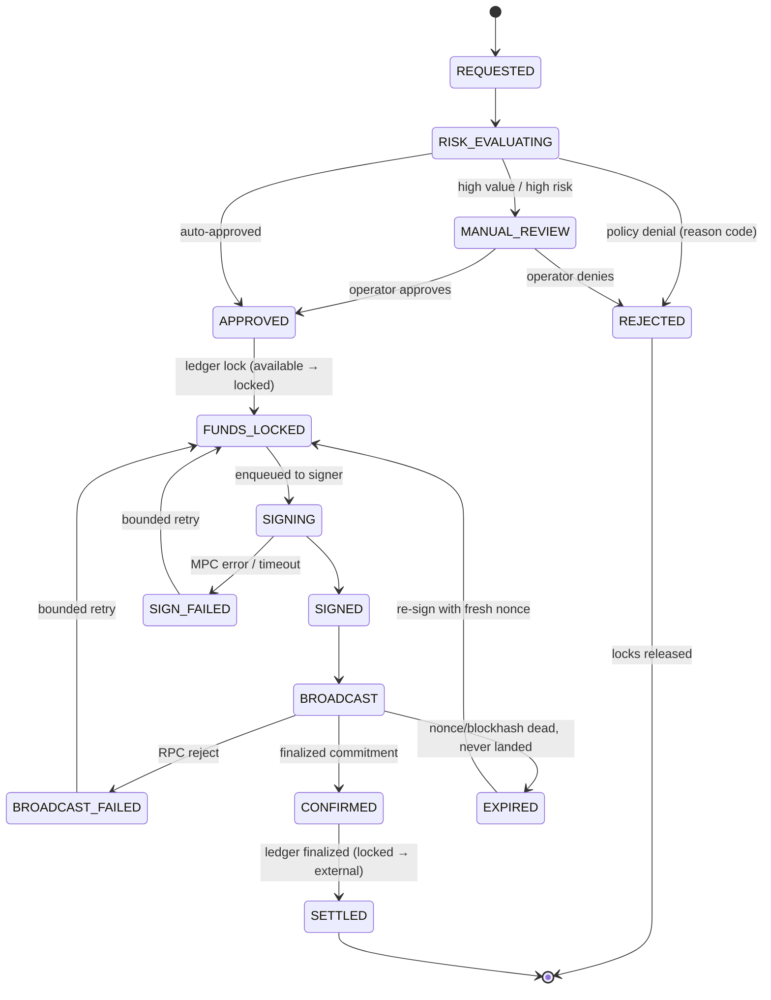

# Build Report — MPC Custodial Solana Wallet

**Source spec:** [`master-prompt.md`](./master-prompt.md) (200 rules)
**Parent project:** Centralized TradFi Crypto Ecosystem — this wallet is Pillar 1 (_Centralized Control Wallet_)
**Date:** 2026-09-10
**Status:** Greenfield — `wallet/` currently contains only the spec.

---

## 1. What the Spec Actually Asks For

Stripped of the 200 individual rules, the spec describes **four subsystems and one hard boundary**:

| Subsystem                                                          | Owns                                                 | Never touches                                     |
| ------------------------------------------------------------------ | ---------------------------------------------------- | ------------------------------------------------- |
| **Web App** (`apps/web`)                                           | Presentation, UX state, client validation            | Keys, balances-as-truth, authorization decisions  |
| **API + Domain** (`apps/api`, `packages/*`)                        | Auth, ledger, risk, orchestration, use cases         | Chain RPC details, cryptography                   |
| **Blockchain Adapters** (`packages/blockchain`, `packages/solana`) | RPC, tx construction, address formats, confirmations | Business rules, ledger, user identity             |
| **MPC Service** (`services/mpc`)                                   | Key shares, threshold signing                        | Business logic, authorization, HTTP session state |

**The hard boundary** is rule 109: _authorization to sign_ and _the act of signing_ are separate systems. The API decides a withdrawal is allowed; the MPC service produces bytes. Neither can do the other's job. Every design decision below defends that line.

### The three invariants everything else serves

1. **Double-entry, integer base units, immutable entries** (rules 111–116). A user's balance is never a mutable column — it is `SUM(credits) - SUM(debits)` over an append-only ledger, denominated in lamports / token base units.
2. **Idempotency on every financial write** (rules 85, 128, 130, 174, 182). A blockchain signature credits exactly once. A withdrawal request with the same idempotency key creates exactly one withdrawal.
3. **Internal liabilities ≤ chain-controlled assets** (rule 120). Reconciliation is a first-class product feature, not an afterthought.

### Explicit non-goals (from the spec itself)

- Not production custody (rules 7, 8) — no audit, no real user funds.
- No self-invented cryptography (rule 106) — use vetted threshold libraries only.
- No multichain until Solana is stable (rule 195) — but keep the seams (rules 25, 48, 196).
- Not a browser extension (rule 2), no seed phrases shown to users (rule 4).

---

## 2. System Flow

### 2.1 Request path



The red boundary is the only place key material exists. Nothing above it ever holds a share, and the API talks to it through one interface (`Signer`) that knows nothing about Ed25519, FROST, or share counts.

### 2.2 Deposit flow (money in)



**Attribution model — a Phase 2 decision.** Solana has no memo-based deposit convention that users reliably follow. The recommended model is **one derived deposit address per user per asset**, swept into an omnibus hot wallet. Consequence: deposit-address keys are a _separate, lower-privilege key class_ from the MPC-protected treasury — otherwise every user address multiplies the MPC key ceremony cost. Deposit keys sweep only, to one hardcoded destination; the treasury is where MPC actually matters.

Two Solana-specific costs the ledger must model from day one:

- **Rent exemption** — every account and every SPL Associated Token Account needs a minimum SOL balance (~0.00089 SOL / ~0.00204 SOL respectively) that is _not_ user-withdrawable.
- **Fee funding** — sweeping an SPL deposit requires SOL in the deposit account to pay fees. A fee-funding job must top up before a sweep, and those lamports are a house expense account in the ledger, not a user credit.

### 2.3 Withdrawal flow (money out) — the core state machine



**Only `APPROVED` may enter the signing queue** (rule 138). The signer worker re-reads state inside the transaction that claims the job; it never trusts the queue payload.

**Use durable nonce accounts, not recent blockhashes.** A Solana recent blockhash expires in ~150 slots (roughly 60–90 seconds). An MPC signing round — coordination, threshold shares, network hops, possible manual review — can easily exceed that, and a blockhash that dies mid-flight forces a re-sign with ambiguous "did it land?" semantics. A durable nonce account makes the transaction valid indefinitely until the nonce advances, which turns the retry story into something deterministic: re-broadcasting the _same signed bytes_ is safe (identical signature, deduplicated by the network), and the nonce advancing exactly once is the proof that the transaction landed exactly once. This is the single most important chain-specific choice in the whole build.

### 2.4 The Signer boundary

```typescript
// packages/blockchain — no Solana types, no crypto types
export interface Signer {
  getPublicKey(keyRef: KeyRef): Promise<PublicKeyBytes>;
  sign(req: SignRequest): Promise<SignResult>; // idempotent on req.requestId
}

export interface SignRequest {
  requestId: string; // idempotency key — same id ⇒ same signature, never a second signing round
  keyRef: KeyRef; // opaque handle; the app never learns what it points at
  payload: Uint8Array; // the exact bytes to sign
  authorization: AuthorizationProof; // who approved this, when, under which policy
}
```

Three implementations over the project's life, all behind this one interface:

1. `MockSigner` — in-memory keypair, loudly labeled dev-only (Phase 3).
2. `RustSingleKeySigner` — real Rust service, real process boundary, one key (Phase 4a).
3. `RustThresholdSigner` — FROST-Ed25519 threshold signing, t-of-n participants (Phase 4b).

Swapping 1 → 2 → 3 must require **zero changes** above the interface. If it doesn't, the abstraction leaked and that is a bug to fix before proceeding.

---

## 3. Repository Layout

```
wallet/
├── apps/
│   ├── web/                 Next.js · dashboard, wallet, deposit, withdraw, activity, security, profile
│   └── api/                 Fastify · routes → controllers → app services; also hosts workers
├── services/
│   └── mpc/                 Rust · signing boundary, share storage, participant coordination
├── packages/
│   ├── types/               shared domain types + API contracts (Zod schemas as source of truth)
│   ├── config/              validated env config — fails fast at boot
│   ├── logger/              structured JSON logging + correlation IDs + redaction allowlist
│   ├── errors/              typed error hierarchy, HTTP mapping table
│   ├── db/                  Prisma schema, migrations, client, transaction helpers
│   ├── auth/                WebAuthn/passkeys, sessions, 2FA, step-up auth
│   ├── ledger/              double-entry domain: accounts, entries, locks, invariants
│   ├── blockchain/          chain-agnostic interfaces: ChainAdapter, Signer, AddressValidator
│   ├── solana/              Solana implementation of the above
│   └── risk/                policy engine, limits, velocity, reason codes
├── infra/
│   └── docker-compose.yml   PostgreSQL, Redis, solana-test-validator
└── docs/                    ADRs, runbooks, threat model
```

Dependency rule, enforced in CI: `packages/ledger` and `packages/risk` may **not** import `packages/solana` or `@solana/*`. Domain depends on `packages/blockchain` interfaces only (rule 25).

---

## 4. Core Data Model

The tables that carry the invariants. Everything else is supporting detail.

| Table                    | Purpose                                                                                     | Critical constraint                                       |
| ------------------------ | ------------------------------------------------------------------------------------------- | --------------------------------------------------------- |
| `users`                  | identity                                                                                    | —                                                         |
| `credentials`            | passkeys, 2FA secrets                                                                       | secrets encrypted at rest                                 |
| `sessions`               | server-side sessions                                                                        | rotation on privilege change                              |
| `wallets`                | custody grouping per user                                                                   | —                                                         |
| `addresses`              | on-chain addresses + custody role (`deposit`/`hot`/`warm`/`cold`)                           | `UNIQUE(chain, address)`; **public data only**            |
| `key_refs`               | opaque handles into MPC                                                                     | **never stores share material**                           |
| `ledger_accounts`        | `(owner, asset, type)` where type ∈ `available`,`locked`,`omnibus`,`fees`,`external`,`rent` | `UNIQUE(owner_id, asset, type)`                           |
| `ledger_entries`         | append-only debits/credits, integer base units                                              | immutable — no `UPDATE`, no `DELETE` grant                |
| `ledger_transactions`    | groups entries; balanced                                                                    | **`SUM(debits) = SUM(credits)`, enforced in-transaction** |
| `deposits`               | detected on-chain credits                                                                   | **`UNIQUE(chain, tx_signature, instruction_index)`**      |
| `withdrawals`            | request + state machine                                                                     | `UNIQUE(user_id, idempotency_key)`                        |
| `withdrawal_transitions` | audit trail of every state change                                                           | append-only                                               |
| `signing_requests`       | what was asked of MPC, what came back                                                       | records outcome, **never the payload's secrets**          |
| `risk_decisions`         | every evaluation with reason codes                                                          | append-only, replayable                                   |
| `audit_log`              | security-sensitive operations                                                               | append-only                                               |

Amounts are `NUMERIC(38,0)` or `BIGINT` — **never** `float`, `double`, or JS `number` for money (rule 115). Serialize as strings over the wire.

---

## 5. The Four Phases

Sizing assumes a small team and is relative, not a commitment.

```mermaid
gantt
  dateFormat X
  axisFormat %s
  section Build
  P1 Foundation & Identity      :p1, 0, 3
  P2 Custody & Money-In         :p2, after p1, 4
  P3 Money-Out & Risk           :p3, after p2, 4
  P4 Real MPC & Hardening       :p4, after p3, 5
```



---

### Phase 1 — Foundation & Identity

> _"A real user can create an account, authenticate with a passkey, and hit a typed, observable, tested API."_
> Covers spec rules 16–18, 26–70, 81–90, 156–168, 176 · **~3 weeks**

**Why first:** every later phase writes money-moving code. The invariants that make that code safe — validated config, typed errors, transaction helpers, correlation IDs, redaction, CI gates — are worth ten times more when they exist _before_ the ledger than when retrofitted after.

**Build:**

1. pnpm workspace + Turborepo; TypeScript strict everywhere; ESLint dependency-boundary rule enforcing the layering.
2. `packages/config` — Zod-validated env, fails fast at boot with a readable message. No `process.env` access anywhere else.
3. `packages/logger` — structured JSON, correlation ID propagation via async context, **redaction allowlist rather than denylist** (a denylist fails open the first time someone adds a field; rule 90 requires it to fail closed).
4. `packages/errors` — typed hierarchy (`ValidationError`, `AuthzError`, `InsufficientFunds`, `PolicyDenied`, `ChainError`), centralized Fastify error handler, stable error codes in the API contract.
5. `packages/db` — Prisma, `users`/`credentials`/`sessions`/`audit_log`, plus the `withTransaction` helper every ledger write will use.
6. `packages/auth` — WebAuthn registration + authentication, optional email/password + TOTP 2FA, server-side sessions, **step-up auth primitive** (Phase 3 needs it for withdrawals).
7. `apps/api` — Fastify, Zod schema validation on every route, rate limiting on auth endpoints, `/health` reporting DB and Redis.
8. `apps/web` — Next.js + Tailwind, app shell, auth pages, typed API client generated from the shared Zod contracts, empty dashboard/wallet/activity/security shells.
9. `infra/docker-compose.yml` — PostgreSQL + Redis. CI: lint, typecheck, unit tests, migration check.

**Exit criteria**

- [ ] Register with a passkey, log in, log out, session survives restart, session revocable.
- [ ] Every route validates input via Zod; failures return typed errors with stable codes.
- [ ] `grep` for a secret value across log output finds nothing (automated test).
- [ ] Boot with a missing env var fails immediately and names the variable.
- [ ] Fresh clone → `docker compose up && pnpm dev` works from the README alone.
- [ ] CI is green and blocks merge.

**Risks:** WebAuthn is fiddly across browsers and origins — pin RP ID/origin config early. Resist scaffolding packages you don't yet use; empty packages rot.

---

### Phase 2 — Custody Primitives & Money-In

> _"SOL sent to a user's deposit address appears in their balance, exactly once, and the books balance."_
> Covers spec rules 91–100, 111–130, 189–190, 177, 181 · **~4 weeks**

**Why second:** deposits are the _safe_ half of the money problem — no signing required, so the ledger can be proven correct before any key material is involved. Doing withdrawals first would mean debugging accounting bugs and signing bugs simultaneously.

**Build:**

1. **Address strategy ADR** — decide and write down: per-user derived deposit addresses swept to an omnibus hot wallet, with deposit keys as a distinct low-privilege class. Document the rejected alternatives (memo-based omnibus, per-user MPC keys) and why.
2. `packages/ledger` — accounts, balanced transactions, **available vs. locked as separate accounts rather than columns**, balance projection, and the invariant checks. Pure functions with zero infrastructure imports.
3. Ledger persistence in `packages/db` — `SERIALIZABLE` or explicit row locks for balance-affecting writes; a DB-level check that entries in a transaction sum to zero; revoke `UPDATE`/`DELETE` on `ledger_entries` at the role level so immutability is enforced by the database, not by convention.
4. `packages/blockchain` — `ChainAdapter`, `AddressValidator`, `Signer`, `TransferEvent` interfaces. No Solana imports.
5. `packages/solana` — RPC client, address derivation, address validation (including **on-curve / PDA rejection**), transfer parsing, commitment handling.
6. **Indexer worker** — polls `getSignaturesForAddress` per watched address with a persisted slot cursor, parses SOL transfers, waits for `finalized`, and writes deposit + ledger entries in **one database transaction**. The `UNIQUE(chain, signature, instruction_index)` constraint _is_ the idempotency mechanism — a duplicate is a caught constraint violation and a no-op, never a read-then-write race.
7. Deposit API + UI — address display, QR, deposit history, live balance via WebSocket.
8. Reconciliation v0 — a script comparing on-chain balances against internal liabilities per asset.

**Exit criteria**

- [ ] Property tests: no sequence of ledger operations makes total debits ≠ total credits, or drives an available balance negative.
- [ ] Replaying the same deposit 100× concurrently credits exactly once (integration test against real PostgreSQL).
- [ ] Indexer restart mid-batch loses nothing and double-credits nothing.
- [ ] Balance is _computed from entries_, never read from a mutable field — verified by there being no such field.
- [ ] Against `solana-test-validator`: airdrop → detected → credited → visible in the UI.
- [ ] Reconciliation reports zero drift after a mixed deposit run.

**Risks:** `getSignaturesForAddress` pagination and slot-cursor handling is where correctness bugs hide — test restarts explicitly. Solana forks below the `finalized` commitment, so crediting at `confirmed` is a real double-credit vector; credit only at `finalized` and make the commitment policy a single config value (rule 125).

---

### Phase 3 — Money-Out, Risk & the Mock Signer

> _"A user withdraws SOL to an external address through risk checks, fund locking, a mock signature, a real broadcast, and ledger settlement."_
> Covers spec rules 101–110 (interface only), 117–119, 131–155, 191–192, 178–184 · **~4 weeks**

**Why third:** the full withdrawal lifecycle is exercised end to end while the signer stays trivially controllable. A mock signer can be made to fail, hang, or return garbage on demand — which is exactly how the retry, timeout, and expiry paths get tested. Those paths are nearly impossible to test properly against real MPC.

**Build:**

1. `packages/risk` — pure, deterministic policy engine: per-transaction limits, rolling 24h limits, velocity checks, destination validation, new-destination cooldown, manual-review thresholds. Every evaluation returns a decision plus **reason codes** and is persisted (rule 152). Inputs in, decision out — no HTTP, no DB (rule 179).
2. Withdrawal state machine — an explicit transition table, with illegal transitions rejected by the type system _and_ a database check constraint. Every transition writes to `withdrawal_transitions`.
3. Fund locking — `available → locked` as a balanced ledger transaction at approval time (rule 118). Locks release on rejection/expiry and settle on confirmation. A lock is never a column update.
4. `MockSigner` — deterministic, in-memory, **refuses to start when `NODE_ENV=production`**, and logs a loud banner on every call. Configurable fault injection for tests.
5. **Durable nonce accounts** — provision, track, and advance them; this is what makes signing latency and retries safe (see §2.3).
6. Signer worker — claims `APPROVED` withdrawals, re-validates state inside the claiming transaction, builds the transaction, calls `Signer.sign()` with the withdrawal ID as the idempotency key, persists the `signing_request` record.
7. Broadcast + confirmation workers — submit, persist the signature _before_ awaiting confirmation, poll to `finalized`, then settle the ledger. Re-broadcast identical bytes on ambiguity; never re-sign without proving the prior attempt is dead.
8. Step-up authentication on withdrawal submission (passkey re-assertion), plus rate limiting and idempotency keys on the endpoint (rules 87, 162, 163).
9. Withdrawal UI — request form with client validation, live lifecycle status, every state from §2.3 rendered explicitly (rules 78, 79).
10. Operator surface — minimal internal manual-approval queue for `MANUAL_REVIEW`.

**Exit criteria**

- [ ] Every transition in the §2.3 diagram has a passing test, including all failure edges.
- [ ] Submitting the same idempotency key 50× concurrently creates one withdrawal and moves funds once.
- [ ] Killing the signer worker between `SIGNED` and `BROADCAST` recovers with no double-spend and no lost funds.
- [ ] Risk rules are unit-tested with zero HTTP or DB involvement; every denial carries a reason code.
- [ ] A client crafting an approved-looking request cannot bypass server-side risk evaluation (explicit test, rule 154).
- [ ] Devnet E2E: request → risk → lock → sign → broadcast → finalized → settled, with the ledger balanced at every step.
- [ ] Playwright covers the full deposit and withdrawal journeys.

**Risks:** the ambiguous-broadcast case (submitted, unclear whether it landed) is the highest-consequence bug in the system — durable nonces plus "persist signature before awaiting" are the mitigations, and both need explicit chaos tests. Watch for risk logic leaking into controllers; it belongs in `packages/risk` alone (rule 70).

---

### Phase 4 — Real MPC, SPL Tokens & Operational Hardening

> _"The mock is gone. Signing happens in Rust behind a threshold, tokens work, the books reconcile, and operations are observable."_
> Covers spec rules 19–24, 101–110 (full), 144, 166–175, 185–187, 193–200 · **~5 weeks**

**Why last:** it is the highest-risk, highest-expertise work, and it drops into a slot whose shape is already proven by three phases of use. Sequenced first, MPC design decisions would have been made blind.

**Split into two sub-phases** — do not attempt both at once.

#### 4a — Rust service, single key

Stand up `services/mpc` as a real process with a real trust boundary: mutual-TLS or signed-request authentication, its own datastore, key material never leaving it, and an audit log of signing requests that records _what was asked and what happened_ but never the secrets (rule 110). Implement `RustSingleKeySigner` behind the existing `Signer` interface. The whole test suite from Phase 3 must pass against it **with no changes above the interface** — that is the proof the abstraction held. Add `services/mpc` to health checks and `cargo test` to CI.

#### 4b — Threshold signing

Replace single-key with **t-of-n threshold Ed25519 using a vetted library — FROST-Ed25519 (RFC 9591), via an established Rust implementation.** Never a hand-rolled scheme (rule 106). FROST produces an ordinary Ed25519 signature, so nothing on-chain or in the adapter changes. Model participants as entities distinct from application users (rule 107), run each as a separate process, implement distributed key generation and the signing round protocol, and handle participant unavailability and round timeouts explicitly. Get external review before treating this as anything but educational (rule 8).

#### Also in Phase 4

- **SPL tokens** — Associated Token Accounts, per-token decimals as base-unit integers, ATA creation costs and rent modeled as house expense accounts, token deposit detection, token withdrawal, and a token allowlist (rules 124, 194).
- **Sweeps + custody tiers** — deposit → hot sweeps with fee funding; hot/warm/cold as roles on addresses with threshold-based rebalancing and different signing policies per tier (rules 96–98).
- **Reconciliation as a product** — scheduled job comparing internal liabilities against chain-controlled assets per asset, with drift alerting and an internal report UI (rules 120, 172).
- **Observability** — metrics for deposits, withdrawals, failures, latency, queue depth; health checks across API, PostgreSQL, Redis, Solana RPC, and MPC; a dead-letter queue with a retry surface for failed jobs (rules 170, 171, 173).
- **Security pass** — threat model document, TLS everywhere, least-privilege DB roles per service, secret manager instead of env files, audit-log coverage review, dependency audit.
- **Multichain seams (design only, no second chain)** — verify `packages/ledger` and `packages/risk` still have zero chain imports; write the ADR describing what adding a second chain would touch (rules 195, 196).

**Exit criteria**

- [ ] `MockSigner` is deleted from all non-test code paths; production config cannot select it.
- [ ] Phase 3's full suite passes against the Rust threshold signer, unmodified above the interface.
- [ ] No single participant process can produce a valid signature alone (proven by test).
- [ ] Killing one of n participants still signs when t remain; killing to below t fails cleanly with funds still locked and recoverable.
- [ ] SPL deposit and withdrawal work end to end on devnet, with rent and fees correctly attributed to house accounts.
- [ ] Reconciliation runs on a schedule and alerts on injected drift.
- [ ] Every long-running workflow exposes an operational status (rule 175).
- [ ] `cargo test` and Vitest both green in CI; `docs/` holds the threat model, ADRs, and runbooks.

**Risks:** this is the phase where scope explodes. 4b is genuinely hard distributed-systems-plus-cryptography work — timebox it, and if threshold signing stalls, **ship 4a plus everything else** rather than blocking tokens, reconciliation, and observability behind it. The single-key Rust service already delivers the process boundary, which is most of the architectural value.

---

## 6. Rule → Phase Traceability

| Spec section              | Rules   | Phase                                    |
| ------------------------- | ------- | ---------------------------------------- |
| Project identity, purpose | 1–15    | cross-cutting                            |
| Core architecture         | 16–25   | 1 (structure) · 4 (MPC boundary)         |
| Tech stack                | 26–40   | 1 · 4 (Rust)                             |
| Monorepo structure        | 41–55   | 1                                        |
| Code organization         | 56–70   | 1 (enforced ongoing)                     |
| Frontend architecture     | 71–80   | 1 (shell) · 2 (deposit) · 3 (withdrawal) |
| Backend architecture      | 81–90   | 1                                        |
| Wallet & custody model    | 91–100  | 2 · 4 (tiers)                            |
| MPC boundary              | 101–110 | 3 (interface + mock) · 4 (real)          |
| Ledger design             | 111–120 | 2 · 3 (locks)                            |
| Deposit flow              | 121–130 | 2                                        |
| Withdrawal flow           | 131–144 | 3                                        |
| Risk & policy             | 145–155 | 3                                        |
| Security                  | 156–167 | 1 (baseline) · 4 (hardening)             |
| Observability & ops       | 168–175 | 1 (logging) · 4 (metrics, recon)         |
| Testing                   | 176–187 | every phase                              |
| Development sequence      | 188–200 | this document                            |

---

## 7. Decisions Needed Before Phase 2

These block real work and should be settled as ADRs in `docs/`:

1. **Deposit address model** — per-user derived addresses (recommended) vs. omnibus + reference. Determines indexer design, sweep economics, and MPC key count.
2. **Deposit key custody class** — confirm deposit keys are lower-privilege and sweep-only, distinct from MPC-protected treasury keys. Without this, per-user addresses make MPC costs unbounded.
3. **Confirmation policy** — `finalized` for crediting (recommended); document the drift risk of anything weaker.
4. **Indexer transport** — RPC polling (simple, start here) vs. Geyser/Yellowstone gRPC vs. a webhook provider. Polling is correct for the educational scope; keep it behind an interface.
5. **Threshold parameters** — the `t` and `n` for Phase 4b, and what a participant is (process, host, operator).
6. **Asset allowlist** — SOL only through Phase 3; which SPL tokens in Phase 4.

## 8. Standing Rules for Every Phase

Rule 197 applies without exception: every feature ships with tests, typed interfaces, error handling, structured logging, and documentation. Rules 198–199 are the tiebreaker whenever a design argument stalls — **prefer the simple explicit thing, and optimize for correctness, auditability, and security boundaries before performance.**
