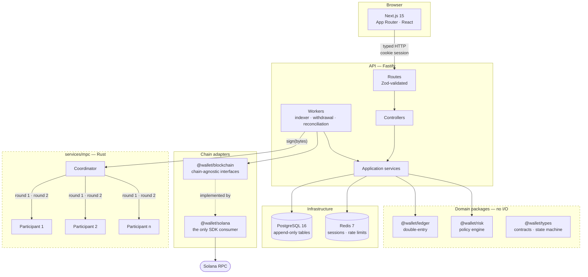
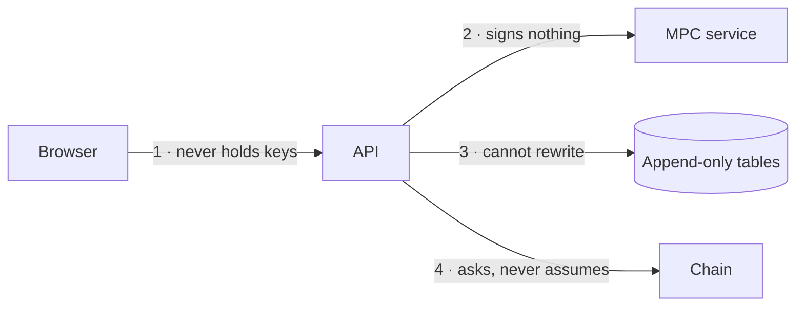
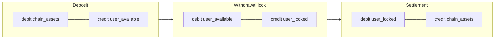
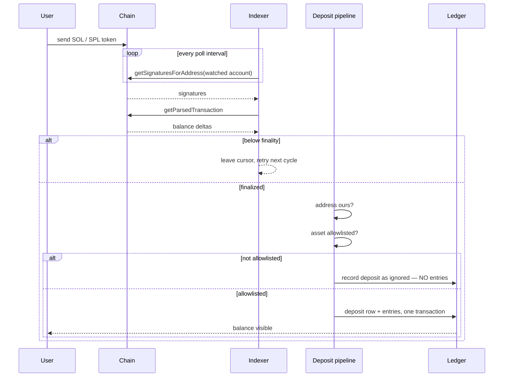
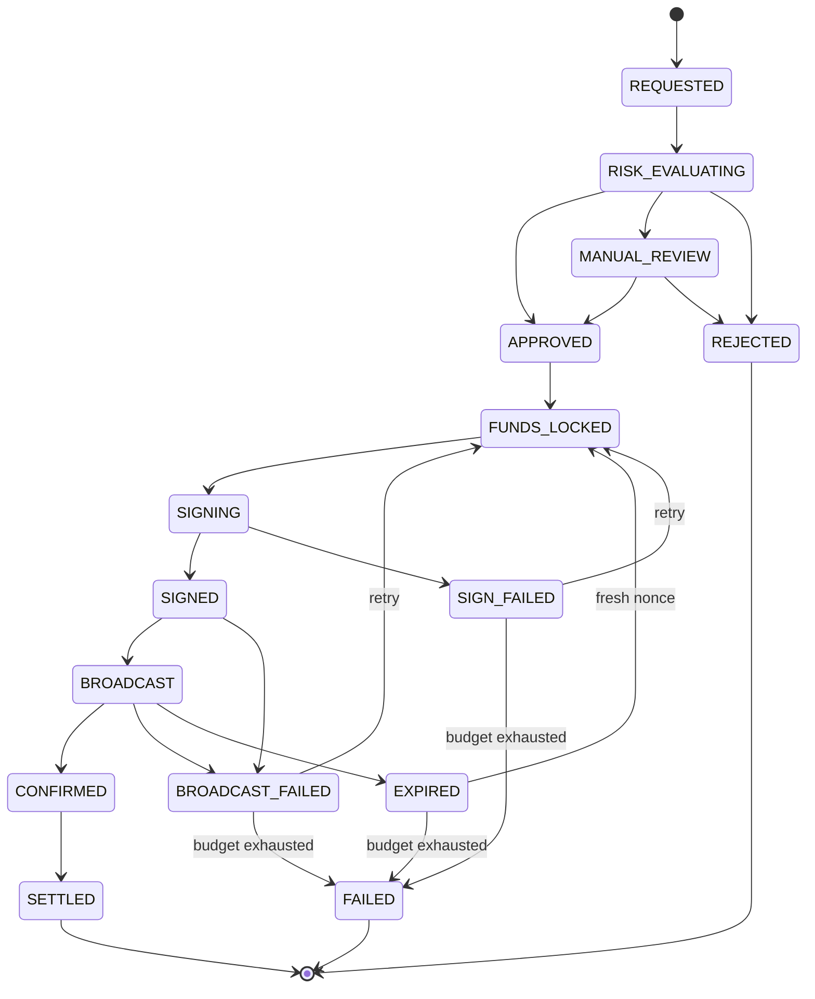
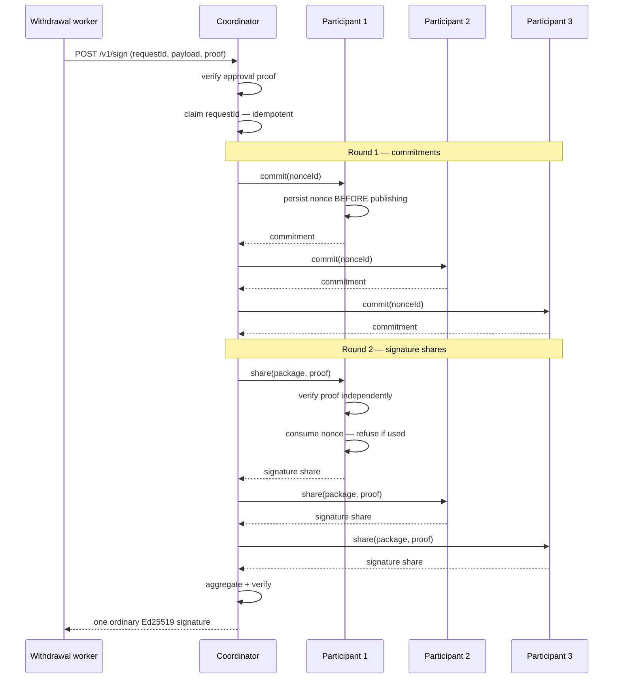
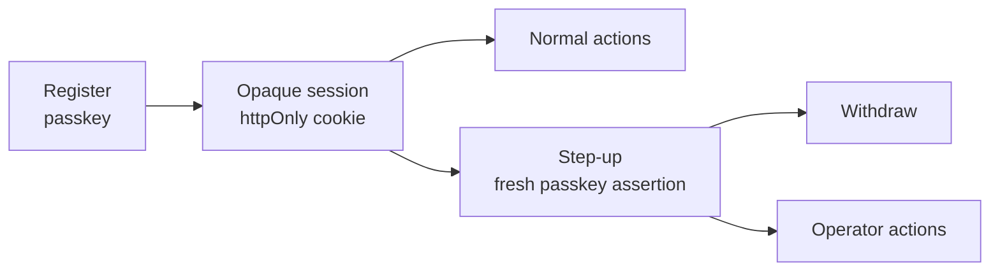
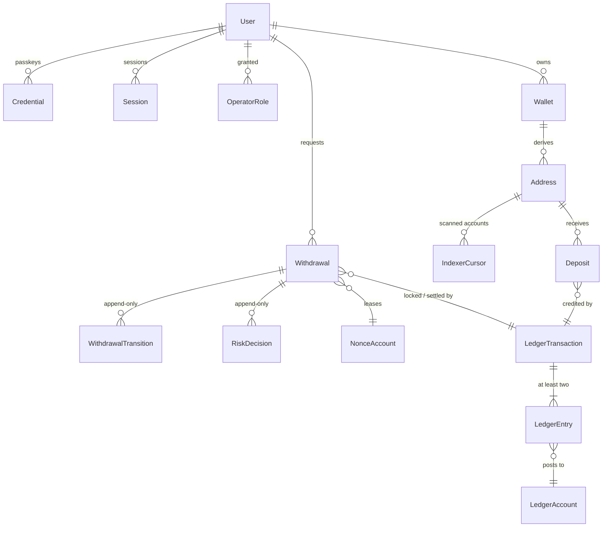

# Atlas Wallet — Implementation Reference

A custodial Solana wallet built as the first product in the Atlas ecosystem.
Users hold, receive and send SOL and allowlisted SPL tokens without ever
touching a seed phrase; custody sits behind a threshold-signing boundary and
every movement is double-entry accounted.

> **Not audited. Not production custody. Never point this at real funds.**
> This is an engineering and learning project. The [threat
> model](./docs/security/threat-model.md) states specifically what is and is not
> defended — read it before forming an opinion about the security of any of
> this.

---

## Contents

- [At a glance](#at-a-glance)
- [System architecture](#system-architecture)
- [The four boundaries](#the-four-boundaries)
- [Money: the double-entry ledger](#money-the-double-entry-ledger)
- [Deposit lifecycle](#deposit-lifecycle)
- [Withdrawal lifecycle](#withdrawal-lifecycle)
- [Threshold signing](#threshold-signing-3-of-5-frost)
- [Custody tiers and authorization](#custody-tiers-and-authorization)
- [SPL tokens](#spl-tokens)
- [Identity and sessions](#identity-and-sessions)
- [Operations](#operations)
- [Data model](#data-model)
- [Running it](#running-it)
- [Testing](#testing)
- [What is not built](#what-is-not-built)
- [Decision record](#decision-record)

---

## At a glance

|                |                                                            |
| -------------- | ---------------------------------------------------------- |
| **Chain**      | Solana (localnet / devnet / testnet / mainnet-beta)        |
| **Signing**    | 3-of-5 FROST-Ed25519, or single-key, selected by role      |
| **Accounting** | Double-entry, append-only, balances as projections         |
| **Identity**   | WebAuthn passkeys, opaque server-side sessions, TOTP       |
| **Stack**      | TypeScript / Fastify / Next.js / PostgreSQL / Redis / Rust |
| **Source**     | ~10.1k packages · ~7.0k API · ~4.1k web · ~4.8k Rust       |
| **Tests**      | 391 unit · 178 integration · 94 Rust · 24 E2E              |
| **Docs**       | 19 ADRs · 10 runbooks · threat model · dependency policy   |

---

## System architecture



**Dependencies point inward.** `packages/ledger` and `packages/risk` import no
database, no chain, no framework — they take data as arguments and return
decisions. `packages/solana` is the only place a chain SDK may be imported.
Both rules are enforced by lint and by `scripts/verify-boundaries.mjs`, which
writes a deliberate violation of each and fails if lint accepts it.

---

## The four boundaries

Each exists because something specific goes wrong without it.



| #   | Boundary           | What it prevents                                                                                                                                                                             |
| --- | ------------------ | -------------------------------------------------------------------------------------------------------------------------------------------------------------------------------------------- |
| 1   | **Browser ⇸ keys** | No key material, no signing capability, and no authorization decision reaches the client. Client-side redirects are UX only.                                                                 |
| 2   | **API ⇸ signing**  | The API is the coordinator. It can censor (liveness) but cannot forge, and cannot make a participant sign something the approval authority did not authorise.                                |
| 3   | **API ⇸ history**  | `audit_log`, `ledger_entries`, `ledger_transactions`, `withdrawal_transitions`, `risk_decisions` are append-only by `REVOKE` **and** trigger. The application role has no `UPDATE`/`DELETE`. |
| 4   | **Ledger ⇸ chain** | The ledger and the chain are related but distinct sources of truth. Reconciliation compares them; neither is derived from the other.                                                         |

---

## Money: the double-entry ledger

**There is no balance column anywhere.** A balance is always a projection over
immutable entries. That is the single most consequential decision in the system:
it makes history unfalsifiable, makes "what did this user hold last Tuesday" an
answerable question, and makes a half-applied mutation impossible.

### Chart of accounts

| Account type     | Class     | Holds                                            |
| ---------------- | --------- | ------------------------------------------------ |
| `user_available` | liability | What the platform owes a user and they may spend |
| `user_locked`    | liability | Owed, but reserved against a pending withdrawal  |
| `chain_assets`   | asset     | What the platform actually controls on-chain     |
| `house_fees`     | equity    | Prepaid balance network fees are drawn from      |
| `house_rent`     | equity    | Lamports immobilised in rent-exempt minimums     |
| `external`       | contra    | Everything outside this system                   |

Accounts are keyed `(owner_id, asset, type)`. Amounts are integer base units in
`NUMERIC(38,0)` — never a float, never a JS number. Decimals are display
metadata and never enter arithmetic.

### Why `user_locked` is an account, not a column

A lock is a balanced transfer between two accounts. It appears in the entry
history, it reverses by the same mechanism that created it, and it cannot be
half-done. A `locked_amount` column is a mutation: invisible afterwards, and
reversible only by remembering to subtract the right number.



### Invariants, enforced by the database

- **Every transaction balances.** Deferred constraint trigger, checked at commit.
- **At least two entries** per transaction.
- **Non-negative** `user_available`, `user_locked`, `chain_assets`, `house_rent`,
  `house_fees`.
- **`house_fees` non-negative** is not cosmetic: a negative balance means
  network fees were paid out of the pooled assets backing user balances — which
  is to say, out of customer money.

---

## Deposit lifecycle



**Four decisions worth knowing:**

**Balance deltas, not instruction parsing.** SOL arrives by many paths — a plain
transfer, `transferWithSeed`, a CPI from any program, an account closure
refunding rent. An indexer matching `system::transfer` credits some deposits and
silently drops others, and the dropped ones are not a category, they are just
missing money. `preBalances`/`postBalances` are the chain's own accounting.

**The cursor is written last.** Persisted only after the batch it describes has
committed. A crash re-reads rather than skips, and re-reading is a no-op because
deposits are unique on `(chain, tx_signature, instruction_index)`.

**`finalized` only.** A `confirmed` transaction can still be rolled back on a
fork, and crediting one means debiting a user who has already been told their
money arrived.

**Token transfers are discovered at the token account, not the owner.** A token
transfer never touches the owner's address. Measured against a real validator: a
transfer into an existing token account produces 1 signature at the token
account and 0 at its owner. Each deposit address is polled at its own address
**and** at each allowlisted mint's derived token account, each with its own
cursor row.

---

## Withdrawal lifecycle

15 states, 24 legal transitions. The transition table lives in TypeScript and
the database `CHECK` constraint is **generated from it**, so the two cannot
drift.



**Funds are locked at `FUNDS_LOCKED` and only released at `SETTLED` (spent) or
`FAILED`/`REJECTED` (returned).** A withdrawal that exhausts its retry budget
transitions to `FAILED` with its funds released — which is why the dead-letter
retry surface deliberately refuses to resurrect a terminal withdrawal.

### Durable nonces, and why

A transaction built on a recent blockhash expires in ~60 seconds. Threshold
signing plus broadcast plus confirmation does not reliably fit in that window,
and an expired transaction leaves a question with no answer: did it land?

A durable nonce makes the transaction valid indefinitely until the nonce
advances — **and the nonce advancing exactly once is proof the transaction
landed.** That turns "did it land?" into a question the chain answers.

The signing idempotency key is `withdrawal:{id}:{nonce}`, not the withdrawal id
alone. After `EXPIRED` a withdrawal leases a fresh nonce and rebuilds, so the
bytes change; keyed on the id alone, a signer would return a cached signature
over the _old_ transaction.

---

## Threshold signing (3-of-5 FROST)



**The signature is an ordinary Ed25519 signature.** Nothing on-chain knows a
threshold was involved, and `packages/solana` is untouched by it.

### The two properties that make it worth building

**1 — No single participant can sign.** A signature needs three shares. One
compromised host yields one share, which is not a signature and not a key.
Proven by test: any three sign, any two fail cleanly, one share aggregates to
nothing valid.

**2 — Each participant verifies the authorization itself.** If a participant
blindly signed whatever the coordinator sent, 3-of-5 would protect against key
theft and _nothing else_ — a compromised API could ask five honest participants
for a signature paying an attacker and get one. Each participant checks the
proof against a key it holds independently of the coordinator, bound to the
exact payload hash.

### Nonce discipline

In FROST, reusing a nonce across rounds **recovers** the participant's secret
share. Not weakens — recovers.

So the nonce ledger is a table, not a convention: the nonce is persisted
_before_ its commitment is published, and consumed by a conditional `UPDATE`
that decides the winner between two concurrent requests. A crash between
publishing and signing costs a wasted nonce, never a reused one.

A below-threshold signing package is rejected **before** the nonce is consumed —
otherwise a coordinator could exhaust a participant's nonces one undersized
package at a time.

### Roles

One binary, three roles, chosen by `MPC_ROLE`:

| Role          | Holds           | Purpose                                            |
| ------------- | --------------- | -------------------------------------------------- |
| `single-key`  | one full key    | Default. Warns loudly at boot.                     |
| `participant` | one FROST share | Answers round endpoints. Fatal if it has no share. |
| `coordinator` | no key material | Runs rounds; holds only the group public key.      |

The TypeScript side has **no branch for this**. Same request shape, same
idempotency contract, same authentication whether one key or five participants
produced the signature.

---

## Custody tiers and authorization

A tier is defined by **what it takes to move money out of it** — not by a label.

| Tier      | Authorization required             | Threshold | Destination                           |
| --------- | ---------------------------------- | --------- | ------------------------------------- |
| `deposit` | none                               | 1         | **hardcoded**, in the signing service |
| `hot`     | risk engine                        | 3         | any validated                         |
| `warm`    | risk engine **and** an operator    | 3         | any validated                         |
| `cold`    | ceremony (two humans, out of band) | 4         | any validated                         |

Enforcement lives **inside the signing service**, not in the API — the API is
the component the threshold scheme assumes may be compromised.

Two rules govern the check:

**Authority is ordered.** An `operator` satisfies a `risk-engine` requirement; a
`ceremony` satisfies either. The reverse is never true — automation must never
satisfy a requirement for a human, because that is precisely the substitution a
compromised coordinator would like to make.

**Each requirement needs a distinct satisfier.** Warm requires _two independent
approvals_, not "authority of at least operator". Without the distinctness rule
a lone operator satisfies both halves and warm silently becomes one approval.

---

## SPL tokens

Assets are keyed on **mint address, never symbol** — anyone can mint a token
calling itself `USDC`, and a symbol-keyed allowlist is the single most likely
way to credit a user with a worthless lookalike.

```
TOKEN_MINTS=USDC:EPjFWdd5AufqSSqeM2qN1xzybapC8G4wEGGkZwyTDt1v:6
RISK_ASSET_LIMITS=EPjF...Dt1v:10000000000:50000000000:5000000000
```

| Concern      | Handling                                                                                                                                                |
| ------------ | ------------------------------------------------------------------------------------------------------------------------------------------------------- |
| Unknown mint | Recorded as `ignored` with a reason. Never credited, never discarded — a user will ask about it.                                                        |
| ATA rent     | `debit chain_assets / credit house_rent`. Real, ours, not user-withdrawable.                                                                            |
| Fees         | A token transfer cannot pay its own fee. Funding precedes any token movement out of a deposit address.                                                  |
| Decimals     | Display only. `1000000` is the amount; `1.00 USDC` is the rendering.                                                                                    |
| Risk limits  | Per-asset. An allowlisted mint with no configured limits is **denied**, not defaulted — a SOL-shaped limit is 1000× too generous for a 6-decimal token. |
| Withdrawals  | Same state machine, unchanged. Only the transaction bytes differ.                                                                                       |

The SPL `Transfer` instruction is hand-encoded (`[u8 3][u64le amount]`) rather
than pulling in `@solana/spl-token`, and verified against the real program on a
validator — every possible mistake there is silent under unit tests and fatal
on-chain.

---

## Identity and sessions



- **WebAuthn passkeys.** No password to phish or stuff; credentials are bound to
  an origin. No seed phrase ever reaches the browser.
- **Opaque server-side sessions**, hashed at rest, revocable, carrying no claims.
- **Step-up** for withdrawals and operator actions, with a freshness window — a
  session alone cannot move money.
- **TOTP** as an optional second factor, encrypted at rest.
- **Clone detection** on the authenticator sign counter, tolerant of synced
  passkeys that legitimately report zero.
- **CSRF** by `Origin` with `Sec-Fetch-Site` as corroboration; `Origin` wins when
  they disagree.

### Operator roles

Granted in the database, revocable **without a restart**, append-mostly so
"who could approve withdrawals in March" stays answerable. Granting is a CLI on
the host, not an endpoint — a compromised operator session cannot mint more
operators.

`viewer` → read the queue · `approver` → decide withdrawals · `custodian` →
warm-tier movements and role management.

---

## Operations

| Concern                  | Implementation                                                                                                                               |
| ------------------------ | -------------------------------------------------------------------------------------------------------------------------------------------- |
| **Health**               | `/health/live` (no dependencies) and `/health/ready` (postgres, redis, solana, mpc)                                                          |
| **Metrics**              | Prometheus text format at `/operator/metrics`. Closed-set labels only — no user ids, no amounts.                                             |
| **Reconciliation**       | Scheduled. Covers deposit addresses, nonce accounts and the treasury. Alerts on drift that **persists** across cycles, not a single reading. |
| **Negative residual**    | Alerts immediately when nothing is in flight — that means a credit exists for money that never arrived.                                      |
| **Dead letters**         | Jobs that exhaust their budget are parked with their original idempotency key. Retry replays that key; a terminal withdrawal is refused.     |
| **Correlation ids**      | Span request, deposit, withdrawal, ledger and signing.                                                                                       |
| **Network verification** | The API calls `getGenesisHash` at boot and **refuses to start** if `SOLANA_RPC_URL` does not serve `SOLANA_NETWORK`.                         |

### API surface

```
auth      /auth/register/{options,verify}  /auth/login/{options,verify}
          /auth/step-up/{options,verify}   /auth/session  /auth/logout
          /auth/credentials[/:id]          /auth/sessions[/:id]
          /auth/2fa[/enroll|/verify]
wallet    /wallets/addresses  /wallets/:id/addresses
          /balances  /deposits[/:id]  /withdrawals[/:id]
platform  /capabilities  /health/live  /health/ready
operator  /operator/review-queue  /operator/withdrawals/:id/{approve,reject}
          /operator/metrics  /operator/dead-letters[/:id/retry]
mpc       /v1/sign  /v1/public-key  /v1/health
          /v1/frost/commit  /v1/frost/share
```

---

## Data model



**Append-only tables** — `REVOKE` plus `BEFORE UPDATE/DELETE` triggers:
`audit_log`, `ledger_entries`, `ledger_transactions`, `withdrawal_transitions`,
`risk_decisions`. `operator_roles` is append-_mostly_: revocation is an
`UPDATE` to `revoked_at` and nothing else, and a revoked grant cannot be
un-revoked.

**Two database roles.** Migrations run as `wallet_owner`; the application
connects as `wallet_app`, which has no DDL and no `DELETE` on history. Grants
live in migrations, because roles are cluster-scoped and grants are not — a
`migrate reset` would otherwise silently drop them.

---

## Running it

```bash
cp .env.example .env
openssl rand -base64 48   # -> SESSION_SECRET
openssl rand -base64 32   # -> TOTP_ENCRYPTION_KEY

pnpm install
pnpm infra:up                                  # PostgreSQL :5433, Redis :6380
pnpm --filter @wallet/db generate
pnpm --filter @wallet/db migrate:deploy

solana-test-validator --reset --quiet          # a local chain
pnpm build:rust && ./services/mpc/target/release/wallet-mpc

pnpm --filter @wallet/api provision-nonces     # durable nonce pool
pnpm dev                                       # api :4000, web :3000
```

Use `localhost`, not `127.0.0.1` — WebAuthn requires a secure context.

### Secrets

Secrets are **references**, not values:

```
DEPOSIT_SEED=file:/run/secrets/deposit-seed
MPC_KEK=env:KEK_FROM_SOMEWHERE_ELSE
```

A bare value still works, so an existing `.env` deployment is unchanged — but
production **refuses** the deposit seed or the KEK as a literal, because those
two can regenerate everything else.

### Gotchas the runbook covers

- **Reset the database and the validator together.** Addresses derive
  deterministically, so resetting one re-issues addresses that still carry the
  other's on-chain history.
- **Stop your own dev servers before E2E.** Playwright reuses an existing server,
  which will not have the suite's raised rate limits.
- **Re-provision nonces after the integration suite** — its helpers clear the pool.

---

## Testing

| Suite       | Count | What it proves                                                                         |
| ----------- | ----- | -------------------------------------------------------------------------------------- |
| Unit (TS)   | 391   | Domain logic, ledger invariants, risk rules, parsing                                   |
| Integration | 178   | Real PostgreSQL: transactions, constraints, idempotency                                |
| Rust        | 94    | Key handling, the trust boundary, threshold properties                                 |
| E2E         | 24    | Browser journeys with a CDP virtual authenticator                                      |
| Localnet    | —     | Against a real validator: the only place SPL encoding and token discovery are verified |

Plus `scripts/verify-boundaries.mjs`, which writes ten deliberate architectural
violations and fails if lint accepts any of them — because a lint rule that has
silently stopped enforcing looks exactly like a lint rule that is working.

### A recurring lesson

Several times a fully-tested feature turned out to be completely non-functional,
and each time the gap was in a layer no unit test touched:

- Two ESLint boundary rules had silently stopped enforcing.
- Prisma reported **success** for a transaction the database had rolled back.
- 111 tests passed while the MPC service received **zero** requests.
- Token parsing was correct for weeks while nothing was ever fetched to parse.

The CI guards that exist today — the boundary verifier, the signer-swap job that
fails if the real service signed nothing — exist because of those.

---

## What is not built

Stated plainly, because a list of what works is not an honest description on its
own.

| Gap                      | Consequence                                                                                                                                                   |
| ------------------------ | ------------------------------------------------------------------------------------------------------------------------------------------------------------- |
| **No independent audit** | The most important one. Custody systems fail at composition and operation, not primitives.                                                                    |
| **Real DKG**             | Key generation uses a trusted dealer, which briefly holds the whole key. Fine for tests, not for a ceremony.                                                  |
| **Five real hosts**      | The threshold is tested with five participants in one process, each with its own store and KEK. ADR-0015 is explicit that the independence _is_ the security. |
| **Sweep execution**      | Planning and accounting are done; the signing-and-broadcast loop is not.                                                                                      |
| **Deposit seed is hot**  | Lives in the API process environment and can regenerate every deposit key.                                                                                    |
| **Managed secret store** | `env:` and `file:` references exist; a Vault/KMS integration does not.                                                                                        |
| **Per-service DB roles** | Still one `wallet_app`.                                                                                                                                       |
| **Separation of duties** | One approver can approve alone; nothing requires two.                                                                                                         |
| **Cold is not cold**     | A signing policy requiring proofs this system cannot produce — not air-gapped key material.                                                                   |
| **Availability**         | No DDoS protection, no circuit breakers beyond retry budgets.                                                                                                 |
| **Price feed**           | No portfolio valuation. Deliberate: a fabricated number in a wallet is worse than no number.                                                                  |
| **Second chain**         | Design only. [ADR-0019](./docs/adr/0019-second-chain-seams.md) records exactly what one would touch.                                                          |

---

## Decision record

19 ADRs. Each records the alternatives considered and why they lost.

|                                                      | Decision                                           |
| ---------------------------------------------------- | -------------------------------------------------- |
| [0001](./docs/adr/0001-session-strategy.md)          | Opaque server-side sessions                        |
| [0002](./docs/adr/0002-authentication-model.md)      | Passkeys as the primary factor                     |
| [0003](./docs/adr/0003-database-roles.md)            | Two roles; grants live in migrations               |
| [0004](./docs/adr/0004-deposit-address-model.md)     | One derived address per user                       |
| [0005](./docs/adr/0005-deposit-key-custody-class.md) | Deposit keys are a lower-privilege class           |
| [0006](./docs/adr/0006-confirmation-policy.md)       | Credit only at finality · network verified at boot |
| [0007](./docs/adr/0007-indexer-transport.md)         | RPC polling behind an interface                    |
| [0008](./docs/adr/0008-asset-allowlist.md)           | SOL only in Phase 2                                |
| [0009](./docs/adr/0009-durable-nonce-accounts.md)    | Durable nonces resolve broadcast ambiguity         |
| [0010](./docs/adr/0010-risk-policy-baseline.md)      | Deterministic rules with reason codes              |
| [0011](./docs/adr/0011-step-up-tiering.md)           | Step-up freshness tiers                            |
| [0012](./docs/adr/0012-retry-and-expiry-budgets.md)  | Per-edge retry budgets                             |
| [0013](./docs/adr/0013-mpc-trust-boundary.md)        | The signing service as a trust boundary            |
| [0014](./docs/adr/0014-key-material-at-rest.md)      | AES-256-GCM under a KEK                            |
| [0015](./docs/adr/0015-threshold-parameters.md)      | 3-of-5 FROST across failure domains                |
| [0016](./docs/adr/0016-token-allowlist.md)           | Mint-keyed allowlist · token discovery             |
| [0017](./docs/adr/0017-sweep-policy.md)              | A sweep is a withdrawal; fee-only posting          |
| [0018](./docs/adr/0018-custody-tiers.md)             | Tiers defined by signing policy                    |
| [0019](./docs/adr/0019-second-chain-seams.md)        | What a second chain would touch                    |

**Runbooks:** local development · signing outage · participant loss · stuck
sweep · key ceremony · stuck withdrawal · ambiguous broadcast · missing deposit
· reconciliation drift · session secret rotation.

**Security:** [threat model](./docs/security/threat-model.md) ·
[dependency policy](./docs/security/dependency-exceptions.md).
